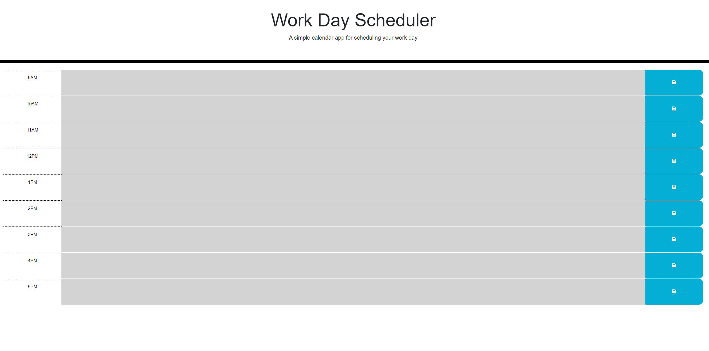

# Work Day Calendar

## Description

This application is a simple calendar application that allows a user to save events for each hour of the work day. It will allow you to save events for the current day by the hour.

## Installation

N/A

## Usage

Upon load of the application, you will see a calendar of the hours of the work day. The hours of the day will have a background color for if it's the current hour (red), a past hour (grey), or a future hour (green). Enter in what you would like to plan out on your schedule for the day, click the save icon to the right, and your day will be scheduled out.

## Credits

N/A

## License

Please refer to the license in the repo.

## Link

https://dbradley555.github.io/work-day-calendar/

---
